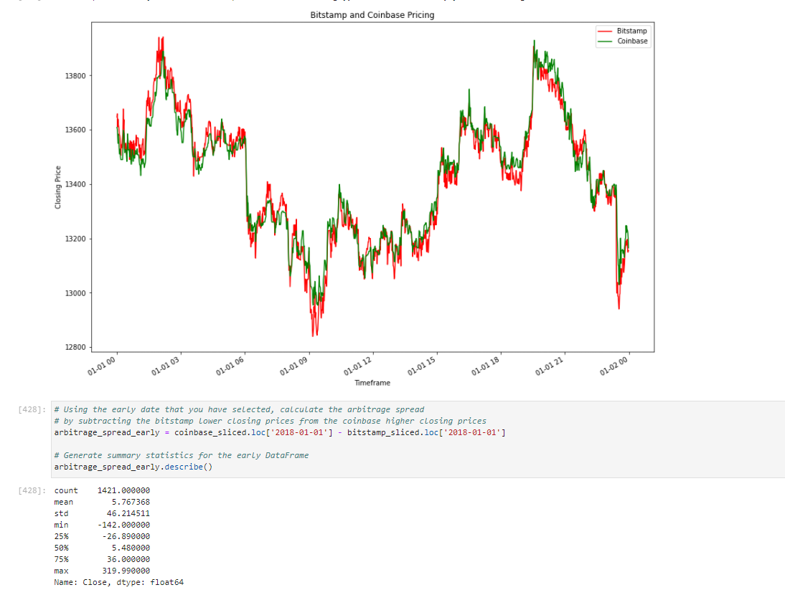

# Project Title: Arbittrage for Bitcoin

The project sorts through historical trade data for Bitcoin on two exchanges: Bitstamp and Coinbase to determine if any arbitrage opportunities exist for Bitcoin.

---

## Technologies:

The project uses python 3.7 with the following packages:

* [pandas](https://pandas.pydata.org/) - For providing data analysis and manipulation tool built on top of the Python programming language

* [%matplotlib](https://matplotlib.org/) - For creating static, animated, and interactive visualizations in Python

* [pathlab](https://docs.python.org/3/library/pathlib.html) - For providing filesystem paths with semantics appropriate for different operating systems. Comes under Python's standard utility modules

* [csv](https://docs.python.org/3/library/csv.html) - For implementing classes to read and write tabular data in CSV format. Comes under Python's standard utility modules


---

## Installation Guide

In this section, you should include detailed installation notes containing code blocks and screenshots.

Before running the application first install the following dependencies:

```python
import pandas as pd
from pathlib import Path
%matplotlib inline
```

---

## Usage

To use the lending software simply clone the repository and replace any replace or use the data files bitstamp.csv and coinbase.csv and go through the written steps in the crypto_arbitrage.ipynb file.


Here is a screenshot




---

## Contributors

Jung Kim aka CHAOS

github.com/chaos4us

---

## License

MIT License
